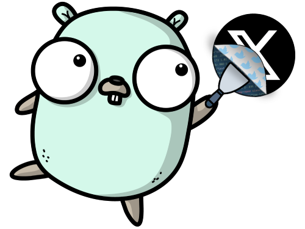

  

<h3 align="center">GoXCrap</h3>

X (formerly Twitter) web scrapper, written in Go

    
    
    

---

# GoXCrap

This application collect tweets based on a defined search criteria, and save them in a database.